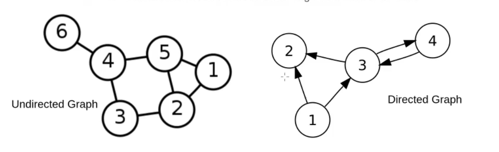
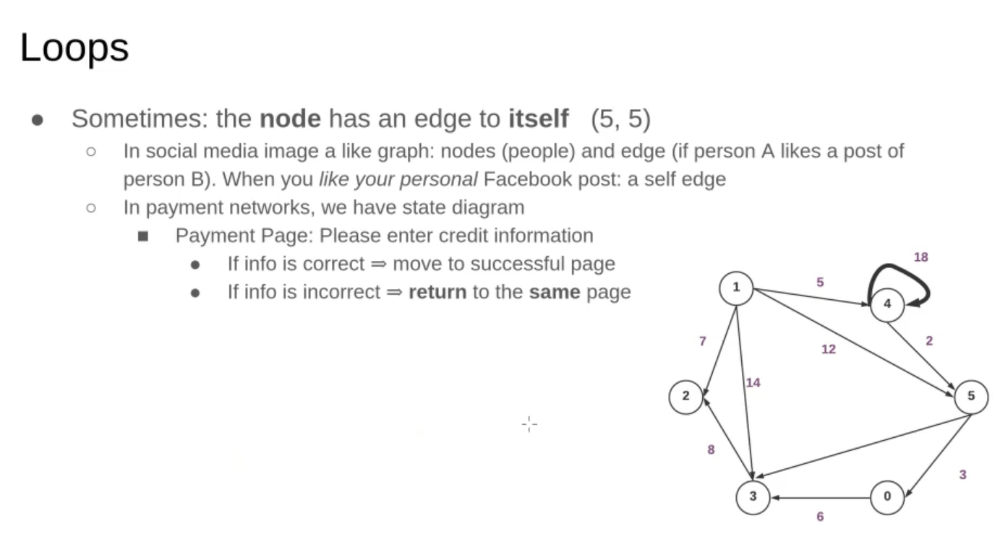

# What is Graph?

Graph Data Structure is a collection of nodes connected by edges. It’s used to represent relationships between different entities. Graph algorithms are methods used to manipulate and analyze graphs, solving various problems like finding the shortest path or detecting cycles.

---

## Components of a Graph:

Vertices: Vertices are the fundamental units of the graph. Sometimes, vertices are also known as vertex or nodes. Every node/vertex can be labeled or unlabeled.

Edges: Edges are drawn or used to connect two nodes of the graph. It can be ordered pair of nodes in a directed graph. Edges can connect any two nodes in any possible way. There are no rules. Sometimes, edges are also known as arcs. Every edge can be labelled/unlabelled.

---

---

if the graph is fully connected or complete, yhen number of edges is `(N * (N-1) / 2)`

---

### Important Notes

A directed acyclic grapg **(DAG)** A directed graph with no directed cycles

Tree us an undirected graph hasing number of edges = N - 1
