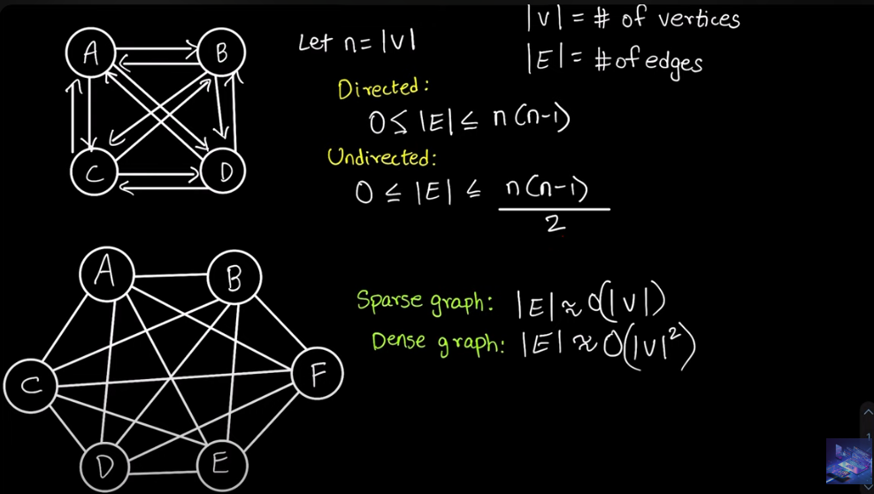

# What is Graph?

Graph is a non-linear data structure consisting of vertices and edges. The vertices are sometimes also referred to as nodes and the edges are lines or arcs that connect any two nodes in the graph. More formally a Graph is composed of a set of vertices( V ) and a set of edges( E ). The graph is denoted by G(V, E).

## Components of a Graph:

Vertices: Vertices are the fundamental units of the graph. Sometimes, vertices are also known as vertex or nodes. Every node/vertex can be labeled or unlabeled.

Edges: Edges are drawn or used to connect two nodes of the graph. They can be an ordered pair of nodes in a directed graph. Edges can connect any two nodes in any possible way. There are no rules. Sometimes, edges are also known as arcs. Every edge can be labeled/unlabeled.

A graph has two types:

1. Directed
2. Undirected

---

If the graph is fully connected or complete, then the number of edges is `(N * (N-1) / 2)`

---

### Important Notes

A directed acyclic graph **(DAG)** is a directed graph with no directed cycles.

A tree is an undirected graph having the number of edges = N - 1.

