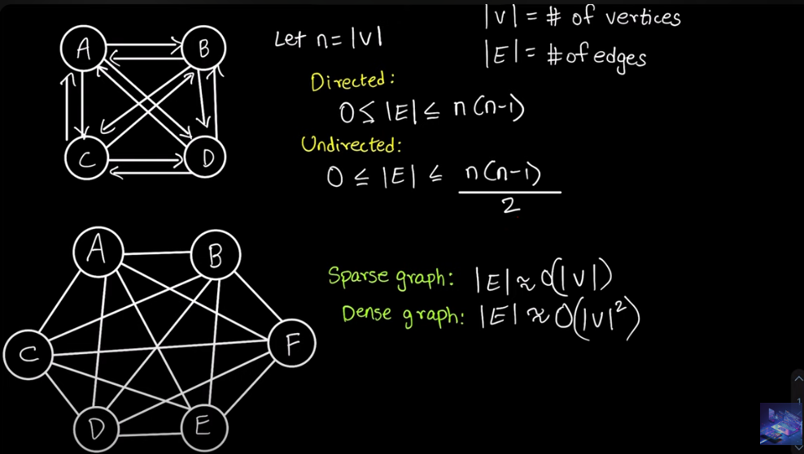
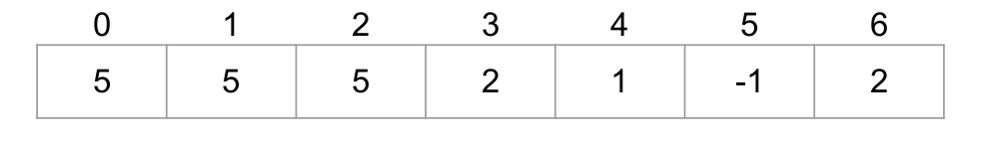

# What is Graph?

Graph is a non-linear data structure consisting of vertices and edges. The vertices are sometimes also referred to as nodes and the edges are lines or arcs that connect any two nodes in the graph. More formally a Graph is composed of a set of vertices( V ) and a set of edges( E ). The graph is denoted by G(V, E).

## Components of a Graph:

Vertices: Vertices are the fundamental units of the graph. Sometimes, vertices are also known as vertex or nodes. Every node/vertex can be labeled or unlabeled.

Edges: Edges are drawn or used to connect two nodes of the graph. They can be an ordered pair of nodes in a directed graph. Edges can connect any two nodes in any possible way. There are no rules. Sometimes, edges are also known as arcs. Every edge can be labeled/unlabeled.

A graph has two types:

1. Directed
2. Undirected

---

If the graph is fully connected or complete, then the number of edges is `(N * (N-1) / 2)`

---

### Important Notes

A directed acyclic graph **(DAG)** is a directed graph with no directed cycles.

A tree is an undirected graph having the number of edges = N - 1.

A node cannot appear twice within a path while traversing, according to the path definition.

Degree is the number of edges a node has, and the total number of degrees a graph has is `2 * no. of edges` for an undirected graph.

---

**Rooted Tree Representation**
A rooted tree representation is a way to depict a tree structure where one node is designated as the root node. The root node is the starting point of the tree and all other nodes are connected to it through edges. Each node in the tree can have zero or more child nodes, and each child node can have its own child nodes. This hierarchical structure allows for efficient traversal and organization of data. In a rooted tree representation, the root node is typically depicted at the top, with child nodes branching out below it. This representation is commonly used in various algorithms and data structures, such as binary trees and decision trees.

---

The time complexity of DFS is O(N+M), where M is the number of edges and N is the number of nodes. For adjacency list representation, the time complexity is O(N+M), while for adjacency matrix representation, it takes O(N^2).

